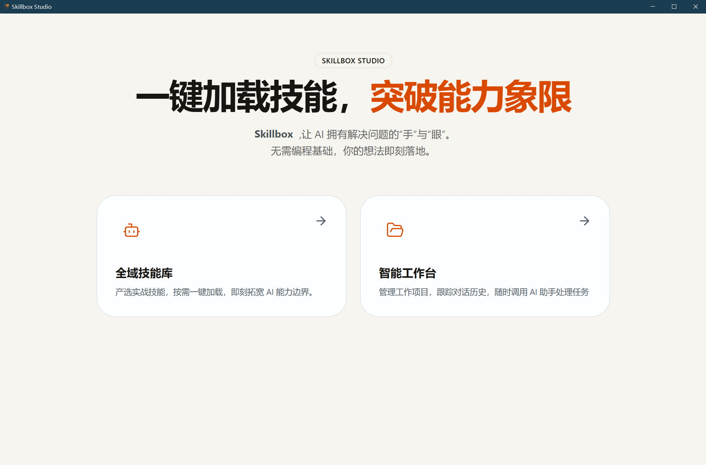
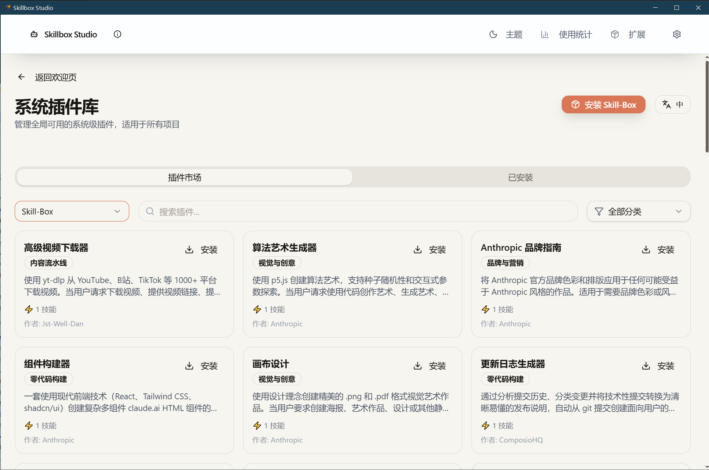
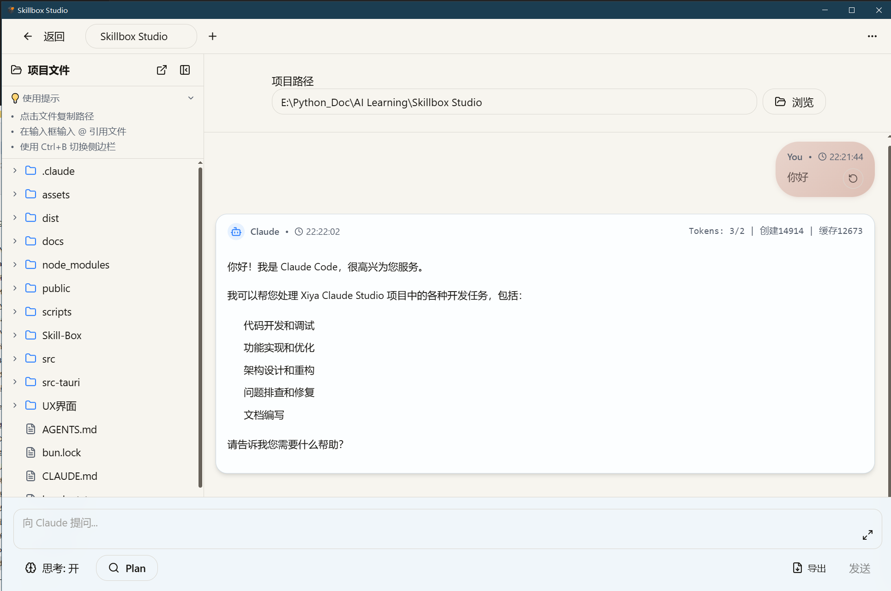
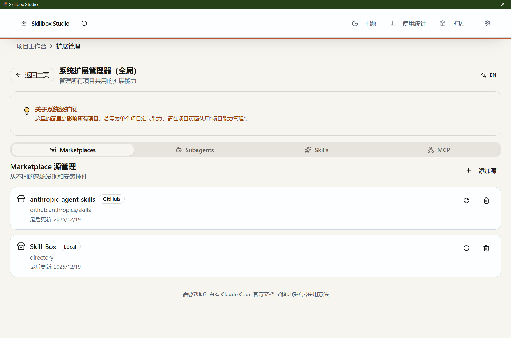
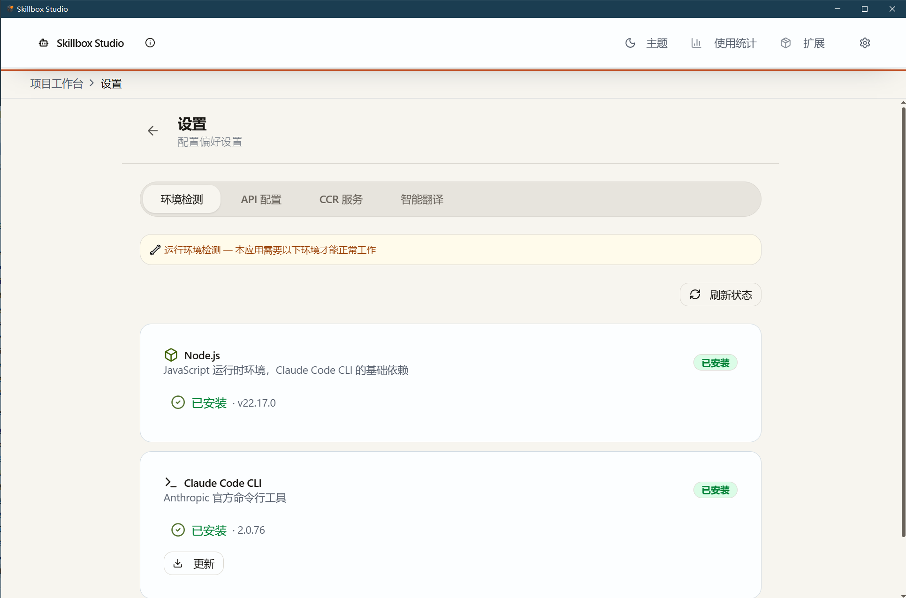
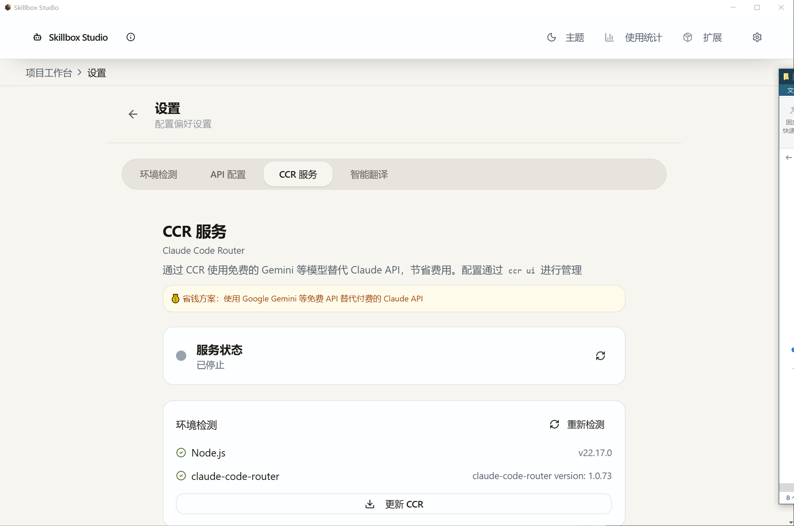
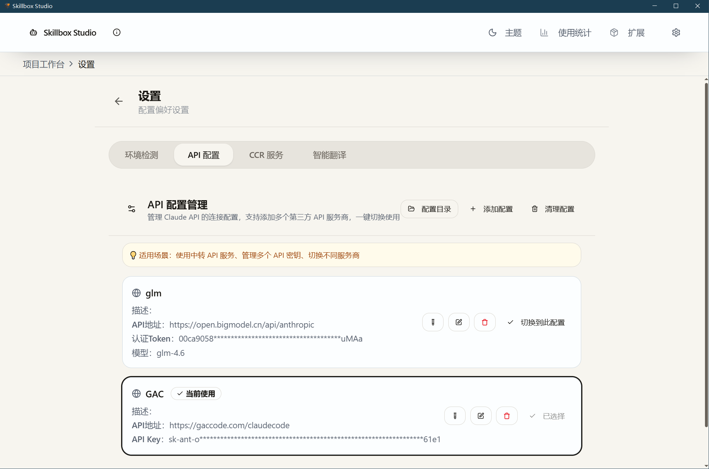
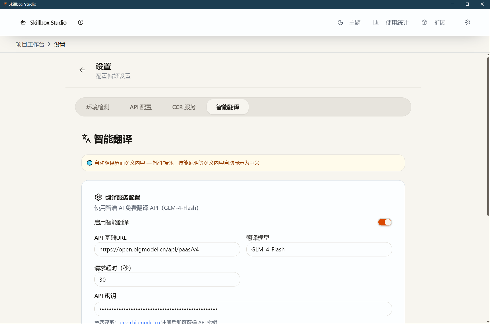

# Skillbox Studio

<div align="center">


**一键加载技能，突破能力象限**

让 AI 拥有解决问题的"手"与"眼"

无需编程基础，你的想法即刻落地。


</div>

---

## 项目简介

**Skillbox Studio** 是一款专为**计算机小白**设计的 AI 智能助手桌面应用。它为 Claude Code 提供了简洁直观的可视化界面，让你无需掌握命令行操作，就能轻松使用强大的 AI 编程助手。

### 核心特点

- **零门槛上手**：图形化界面，告别命令行恐惧
- **一键环境配置**：自动安装 Node.js、Claude Code 等依赖
- **精选技能库**：内置 40+ 实用技能，一键加载即可使用
- **省钱方案**：支持免费的第三方API，降低使用成本

---

## 界面预览

### 欢迎首页


应用启动后的主界面，提供两个核心入口：
- **全域技能库**：浏览和安装 AI 技能
- **智能工作台**：管理项目和对话

### 系统插件库


一键安装 Skill-Box 精选技能，支持按分类筛选和搜索。

### 对话界面



与 AI 助手进行自然语言对话，左侧显示项目文件目录，中间是对话区域，底部提供思考模式、Plan 模式切换。

### 系统扩展管理器


管理已安装的技能、子代理（Subagents）和 MCP 服务器。

### 设置页面


配置应用偏好，包括环境监测、API 配置、CCR 服务、翻译服务。


### 一键安装 Claude Code Router


在设置页面可以一键安装和配置 CCR 服务，无需手动操作命令行。

### 一键切换第三方 API


支持快速切换不同的 API 提供商，包括官方 API 和第三方免费服务（如魔搭社区）。

### 可选 AI 翻译服务


可选配置 AI 翻译服务，实现技能文档的中英文互译，降低语言门槛。

---

## 核心功能

### 1. 全域技能库

内置 **Skill-Box** 精选技能集，让 AI 助手从通用助手进化为专业专家。

| 分类 | 技能示例 | 说明 |
|------|---------|------|
| **办公自动化** | PDF、Word、Excel、PPT | 处理各类办公文档，填写表单，生成报告 |
| **零代码构建** | 前端设计、Git 推送、测试修复 | 辅助编程开发，自动提交代码 |
| **内容流水线** | 网页抓取、下载视频、内容研究写作 | 采集网页内容，下载视频、辅助写作 |
| **视觉与创意** | 图像设计、多媒体创作 | 辅助视觉设计，生成艺术图像，处理多媒体素材 |
| **商业分析师** | CSV 数据分析、可视化 | 分析数据，生成图表 |
| **沉浸式研读** | 深度阅读分析、笔记整理 | 辅助学习和研究 |
| **视觉与创意** | 域名头脑风暴、竞品广告分析 | 辅助商业决策 |

### 2. 智能工作台

- **项目管理**：一键打开文件夹，快速切换项目
- **会话历史**：自动保存对话记录，随时回顾
- **快速访问**：常用项目置顶，提高效率

### 3. 一键环境配置

首次使用时，应用会自动检测你的电脑环境：

- **Node.js**：如未安装，点击官网进行下载安装
- **Claude Code**：一件配置Claude code
- **CCR 服务**：可选安装，用于配置第三方 API

### 4. CCR 服务（省钱方案）

**CCR**（Claude Code Router）可以让你使用免费的**魔搭社区**等第三方 API 来运行 Claude Code，大幅降低使用成本。

---

## 快速开始

### 环境要求

- **操作系统**：Windows 10/11 或 macOS 10.15+
- **存储空间**：至少 500MB 可用空间
- **网络**：需要联网下载依赖和使用 AI 服务

### 安装步骤

1. **下载安装包**
   - 从发布页面下载适合你系统的安装包

2. **运行安装程序**
   - Windows：双击 `.msi` 或 `.exe` 文件
   - macOS：双击 `.dmg` 文件，拖入应用程序文件夹

3. **首次启动**
   - 应用会自动检测环境
   - 如果提示缺少 Node.js，点击"一键安装"按钮

4. **开始使用**
   - 选择"全域技能库"安装你需要的技能
   - 选择"智能工作台"打开你的项目文件夹
   - 在对话框中输入你的需求，开始与 AI 对话

### 首次使用示例

假设你想让 AI 帮你处理一个 Excel 文件：

1. 打开"全域技能库"，找到 **xlsx** 技能，点击安装
2. 打开"智能工作台"，选择 Excel 文件所在的文件夹
3. 在对话框输入：`帮我分析这个 Excel 文件的销售数据`
4. AI 会自动读取文件并给出分析结果

---

## CCR 服务配置（可选）

如果你想使用免费的魔搭社区 API 来降低成本，可以配置 CCR 服务。

### 什么是 CCR？

CCR（Claude Code Router）是一个 API 代理服务，可以将 Claude Code 的请求转发到其他 AI 模型（如 ModelScope），从而使用免费额度。

### 配置步骤

1. 进入"设置" → "CCR 服务"
2. 如果 Node.js 未安装，点击"前往环境检测"先安装
3. 点击"安装/更新 CCR"
4. 点击"配置 (ccr ui)"打开配置界面
5. 在配置界面中添加你的 API Provider（如 ModelScope）
6. 保存配置后，点击"启动 CCR"

### 省钱提示

使用 CCR + ModelScope API，你可以：
- 享受魔搭社区提供的免费 API 额度
- 大幅降低 AI 使用成本
- 在免费额度内完成日常任务

---

## 开发者信息

如果你是开发者，想要参与项目开发或自行编译，请参考以下信息：

### 技术栈

- **后端**：Tauri 2 (Rust)
- **前端**：React 18 + TypeScript + Vite
- **UI**：Tailwind CSS + Radix UI

### 开发命令

```bash
# 安装依赖
npm install

# 启动开发服务器（仅前端）
npm run dev

# 启动完整应用（推荐）
npm run tauri:dev

# 构建生产版本
npm run tauri:build
```

---

## 致谢

- [Claude Code](https://claude.ai/code) - Anthropic 官方 CLI 工具
- [Skill-Box](https://github.com/Jst-Well-Dan/claude-skills-vault) - 精选技能集贡献者
- [Tauri](https://tauri.app/) - 跨平台桌面应用框架
- 所有开源社区贡献者

---

## 许可证

本项目遵循 [AGPL-3.0](LICENSE) 许可证。

### 使用须知

如果您使用、修改或分发本项目代码，需要遵守以下条款：

- **开源义务**：基于本项目的修改版本必须以相同的 AGPL-3.0 许可证开源
- **网络服务条款**：如果您将本项目（或修改版）作为网络服务提供给用户，必须向用户提供完整源代码
- **版权声明**：必须保留原始版权声明和许可证信息
- **变更说明**：对代码的修改需要进行明确标注

---

<div align="center">

**让 AI 成为你的生产力伙伴**

如有问题或建议，欢迎提交 Issue

