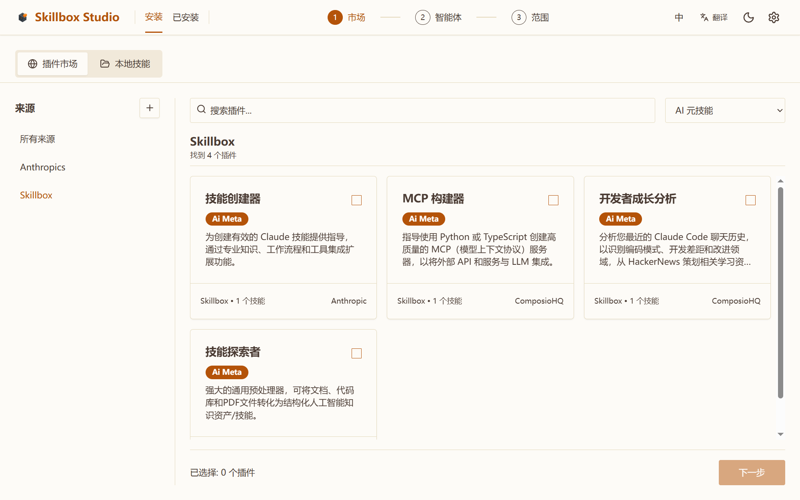
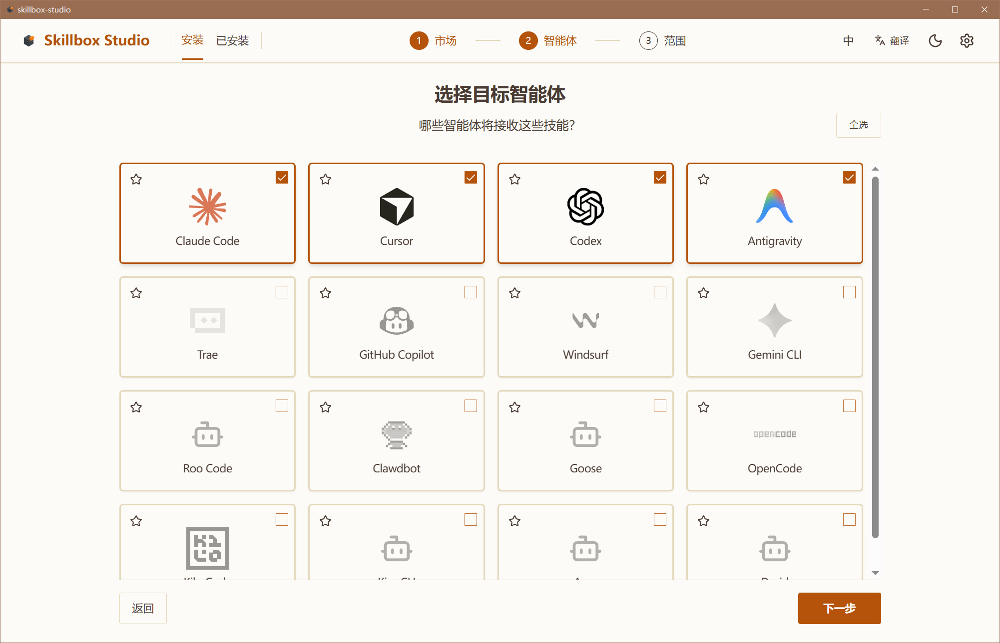
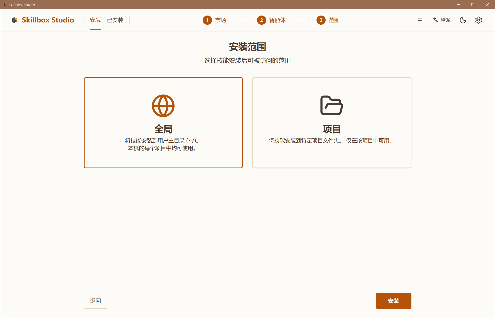
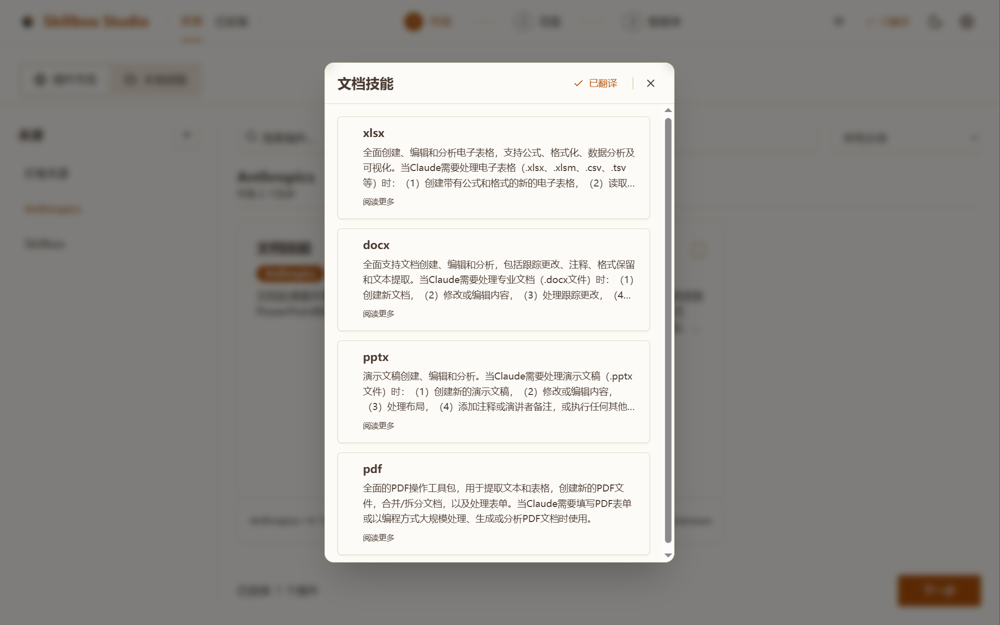
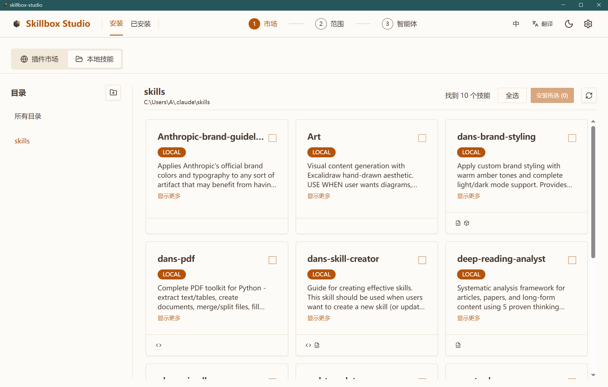
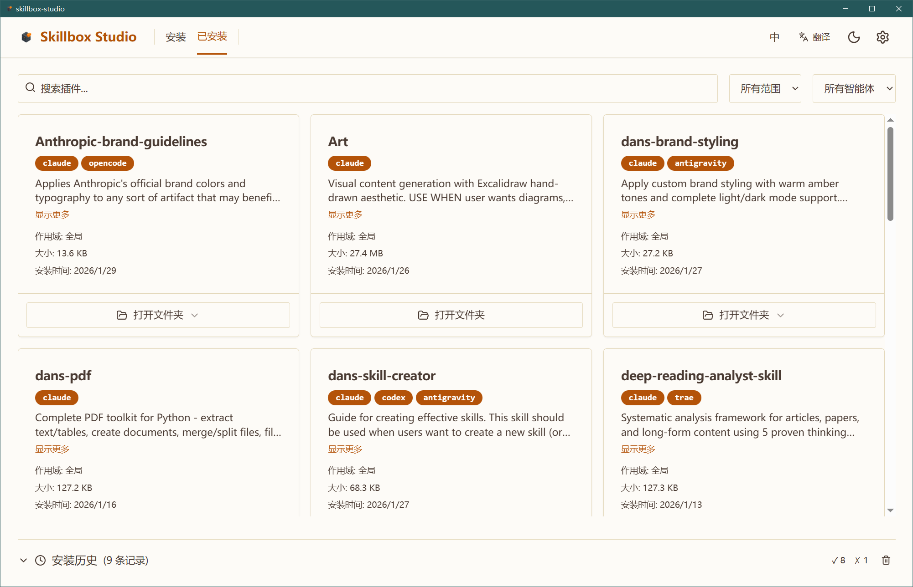

# Skillbox Studio

<div align="center">


**AI Agent 技能的一站式管理中心**

[](https://tauri.app/)
[](https://react.dev/)
[](https://github.com/Jst-Well-Dan/Skillbox-Studio/releases)

[下载最新版](https://github.com/Jst-Well-Dan/Skillbox-Studio/releases) • [核心功能](#-核心功能) • [界面预览](#-界面预览) • [快速开始](#-快速开始) • [开发指南](#-开发指南) • [English](./README.md)

</div>

---

## 📖 简介

**Skillbox Studio** 是一款现代化的桌面应用程序，专为统一管理多种 AI Agent 的扩展技能（Skills / MCP Tools）而设计。

在 AI 辅助编程日益普及的今天，我们经常需要在不同的 Agent（如 **Claude**、**Cursor**、**Windsurf**）之间切换。Skillbox Studio 致力于解决技能碎片化的问题，让您通过一个精美的可视化界面，轻松发现、安装、同步和管理所有强大的 AI 技能包。

## ✨ 核心功能

- **🌐 统一技能市场**
  内置精选技能库（Business, Coding, Writing, Automation 等），提供类似 App Store 的浏览和安装体验。
  
- **🤖 多 Agent 支持**
  一次下载，到处运行。支持一键将技能安装到 Claude, Cursor, Trae 等十余种主流 AI 助手。
  
- **📂 本地技能管理**
  扫描并识别您本地已有的技能目录，轻松将其注册到不同的 Agent 中，无需手动复制粘贴配置文件。

- **🎨 现代化极简设计**
  采用最新的 Fluent/Glassmorphism 设计语言，完美适配深色模式（Dark Mode），提供丝滑的交互动画。

- **🔗 自定义源**
  支持添加第三方的 GitHub 仓库作为技能源，灵活扩展您的技能库边界。

## 📸 界面预览

<details>
<summary><b>点击展开界面预览</b></summary>

### 1. 发现与安装
按照直观的流程，从浏览市场到完成技能安装。

#### 🌐 浏览市场


#### 🤖 选择目标智能体


#### 📂 确认安装范围


---

### 2. 详情与 AI 辅助
深入了解技能功能，内置 AI 翻译打破语言隔阂。

#### 📖 技能详情与 AI 翻译对比

<div align="center">⬇️ AI 一键翻译 ⬇️</div>


---

### 3. 进阶管理与扩展
支持自定义 GitHub 仓库、本地 Skill 导入及全局状态监控。

#### 🔗 添加外部仓库与本地 Skill




#### 📊 全局状态监控


</details>

## 🤝 支持的 Agents

Skillbox Studio 目前支持以下 AI 助手和环境：

| Category | Agents |
|----------|--------|
| **核心 AI** | Claude Code, Gemini CLI |
| **IDE / 编辑器** | Cursor, Windsurf, Trae, GitHub Copilot |
| **开源助手** | Roo Code, Goose, OpenCode, Kilo Code, Kiro CLI |
| **其他** | Clawdbot, Amp, Droid |

## 🚀 快速开始

1. **安装程序**: 请前往 [Releases 页面](https://github.com/Jst-Well-Dan/Skillbox-Studio/releases) 下载适用于您系统的最新安装包。
2. **浏览市场**: 打开应用，在 "Marketplace" 标签页浏览官方推荐的技能。
3. **安装技能**: 点击技能卡片，选择您想要安装的目标 Agent（例如 Claude 或 Cursor），并确认安装范围。
4. **管理已安装**: 在 "Usage" 页面查看各 Agent 已安装的技能，支持一键卸载或更新。
5. **导入本地库**: 如果您在本地有自己编写的技能，可在 "Local" 页面将其导入，并快速分发给多个 Agent。

## 🛠️ 开发指南

### 前置要求
- [Node.js](https://nodejs.org/) (v18+)
- [Rust](https://www.rust-lang.org/) (v1.75+)
- [pnpm](https://pnpm.io/) 或 npm

### 本地启动

```bash
# 1. 克隆项目
git clone https://github.com/Jst-Well-Dan/Skillbox-Studio.git

# 2. 安装前端依赖
npm install

# 3. 启动开发服务器
npm run tauri dev
```

### 构建构建 Release

```bash
npm run tauri build
```

## 🤝 贡献说明

欢迎提交 Pull Request 或 Issue！
- 对于**应用本身**的改进，请直接提交 PR 到本仓库。
- 对于**技能库**的扩充，请参考 `Skill-Box/添加技能指南.md`。

## 📄 许可证

本项目采用 MIT 许可证开源。
