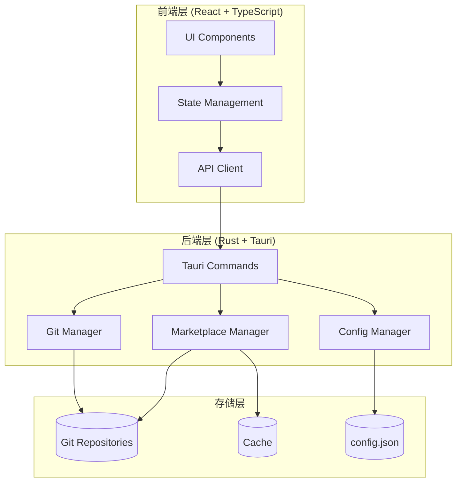

# Skillbox Studio 新功能设计文档

**文档版本**: 1.0  
**创建日期**: 2026-01-26  
**最后更新**: 2026-01-26  
**状态**: 设计阶段

---

## 📑 目录

1. [背景与目标](#背景与目标)
2. [功能一：Git Marketplace 仓库导入系统](#功能一git-marketplace-仓库导入系统)
3. [功能二：设置功能模块](#功能二设置功能模块)
4. [系统架构设计](#系统架构设计)
5. [技术实现细节](#技术实现细节)
6. [数据模型设计](#数据模型设计)
7. [UI/UX 设计方案](#uiux-设计方案)
8. [安全性考虑](#安全性考虑)
9. [测试策略](#测试策略)
10. [实施计划](#实施计划)

---

## 背景与目标

### 存在的问题

1. **Marketplace 数据源固定**
   - 当前通过硬编码路径读取 `Skill-Box/.claude-plugin/marketplace.json`
   - 用户无法自定义或导入其他的 skill marketplace
   - 缺乏对多个 marketplace 仓库的管理能力

2. **设置功能未实现**
   - Topbar 中的设置按钮（Settings）目前无功能
   - 缺少应用配置管理界面
   - 没有用户偏好设置存储

### 设计目标

本设计文档旨在解决上述问题，提供以下功能：

1. **Git Marketplace 仓库管理**
   - 允许用户添加、管理多个 marketplace 仓库
   - 支持从 Git 仓库克隆/更新 marketplace
   - 提供仓库优先级和启用/禁用机制

2. **完整的设置功能模块**
   - Marketplace 仓库管理界面
   - 应用通用设置（主题、语言等）
   - Agent 路径配置
   - 数据管理（缓存、历史记录清理）

---

## 功能一：Git Marketplace 仓库导入系统

### 1.1 功能概述

支持用户通过 Git URL 导入自定义的 skill marketplace 仓库，实现多源 marketplace 管理。

### 1.2 核心需求

#### 1.2.1 仓库管理

**添加仓库**
- 支持通过 Git URL（HTTPS/SSH）添加远程仓库
- 自动克隆仓库到本地存储目录
- 验证仓库结构（必须包含 `.claude-plugin/marketplace.json`）
- 支持设置仓库别名（用户友好名称）

**仓库列表**
- 显示所有已添加的 marketplace 仓库
- 显示仓库状态：已启用/已禁用、最后更新时间
- 区分"官方仓库"和"自定义仓库"

**仓库操作**
- 更新仓库（git pull）
- 删除仓库
- 启用/禁用仓库
- 设置仓库优先级（影响插件展示顺序）
- 查看仓库详细信息

#### 1.2.2 插件聚合

**多源数据聚合**
- 从所有已启用的仓库读取 marketplace.json
- 合并所有插件数据
- 处理插件名称冲突（优先级机制）
- 标记插件来源仓库

**智能去重**
- 当多个仓库包含同名插件时，根据优先级选择
- 显示插件来源信息

### 1.3 技术要点

#### 1.3.1 本地存储结构

```
~/.skillbox-studio/
├── config.json                    # 应用配置
├── repositories/                  # Git 仓库存储
│   ├── official-skillbox/         # 官方仓库（默认）
│   │   ├── .git/
│   │   └── .claude-plugin/
│   │       └── marketplace.json
│   ├── custom-repo-1/             # 自定义仓库1
│   │   ├── .git/
│   │   └── .claude-plugin/
│   │       └── marketplace.json
│   └── custom-repo-2/             # 自定义仓库2
└── cache/                         # 缓存数据
    └── merged-marketplace.json    # 聚合后的marketplace数据
```

#### 1.3.2 Git 操作实现

使用 `git2-rs` crate（Rust）或 Tauri 命令执行系统 git：

**方案 A：使用 git2-rs**
- **优点**：纯 Rust 实现，无需系统 git
- **缺点**：需要添加依赖，打包体积增加

**方案 B：调用系统 git**
- **优点**：轻量，利用用户现有 git 配置
- **缺点**：需要用户安装 git

**推荐**：方案 B（系统 git），通过 Tauri Command 执行

```rust
// 克隆仓库
async fn clone_repository(url: String, dest: PathBuf) -> Result<(), String>

// 更新仓库
async fn update_repository(path: PathBuf) -> Result<(), String>

// 验证仓库
fn validate_marketplace_repo(path: PathBuf) -> Result<bool, String>
```

---

## 功能二：设置功能模块

### 2.1 功能概述

完整的应用设置界面，提供用户配置管理、仓库管理、数据管理等功能。

### 2.2 设置页面结构

#### 2.2.1 选项卡式布局

```
┌─────────────────────────────────────────┐
│  Settings                         [X]   │
├─────────────────────────────────────────┤
│ [General]  [Marketplace]  [Agents]      │
│ [Advanced] [About]                      │
├─────────────────────────────────────────┤
│                                         │
│  (选中选项卡的内容区域)                   │
│                                         │
│                                         │
│                                         │
└─────────────────────────────────────────┘
```

#### 2.2.2 General（通用设置）

**主题设置**
- Light Mode / Dark Mode / Auto（跟随系统）
- 主题颜色选择器

**语言设置**
- English / 简体中文
- 自动检测系统语言

**其他**

- 启动时自动检查更新
- 安装确认对话框（开/关）

#### 2.2.3 Marketplace（仓库管理）

**仓库列表**
- 表格显示所有仓库
  - 名称（别名）
  - Git URL
  - 状态（启用/禁用）
  - 插件数量
  - 最后更新时间
  - 操作按钮（更新/禁用/删除/查看详情）

**添加仓库按钮**
- 打开对话框
  - 输入框：Git URL
  - 输入框：仓库别名（可选）
  - 选择框：认证方式（Public / SSH Key / HTTPS Token）
  - 按钮：验证 & 添加

**仓库优先级管理**
- 拖拽排序功能
- 优先级数字显示


#### 2.2.4 Advanced（高级设置）

**数据管理**
- 清除缓存按钮

- 清除安装历史记录（带日期选择）

  

#### 2.2.6 About（关于）

- 应用版本信息
- 开源许可证
- GitHub 链接
- 检查更新按钮

### 2.3 设置数据存储

#### 2.3.1 配置文件结构

`~/.skillbox-studio/config.json`:

```json
{
  "version": "1.0",
  "general": {
    "theme": "auto",         // "light" | "dark" | "auto"
    "language": "zh-CN",     // "en" | "zh-CN"
    "startup_page": "install",
    "card_density": "comfortable",
    "auto_check_updates": true,
    "confirm_before_install": true
  },
  "marketplace": {
    "repositories": [
      {
        "id": "official",
        "name": "Official Skillbox",
        "url": "https://github.com/username/Skill-Box",
        "type": "official",
        "enabled": true,
        "priority": 1,
        "local_path": "~/.skillbox-studio/repositories/official-skillbox",
        "last_updated": "2026-01-26T00:00:00Z",
        "auth_type": "public"
      },
      {
        "id": "custom-1",
        "name": "My Custom Skills",
        "url": "https://github.com/user/custom-skills",
        "type": "custom",
        "enabled": true,
        "priority": 2,
        "local_path": "~/.skillbox-studio/repositories/custom-repo-1",
        "last_updated": "2026-01-25T12:30:00Z",
        "auth_type": "public"
      }
    ]
  },
  "agents": {
    "custom_paths": {
      "claude": "/custom/path/to/claude",
      "cursor": "/custom/path/to/cursor"
    },
    "custom_icons": {}
  },
  "advanced": {
    "debug_mode": false,
    "cache_enabled": true,
    "max_history_records": 500
  }
}
```

---

## 系统架构设计

### 3.1 整体架构



### 3.2 模块职责

#### 3.2.1 前端模块

**SettingsPage.tsx**
- 设置页面主容器
- 选项卡切换逻辑

**MarketplaceSettings.tsx**
- Marketplace 仓库管理界面
- 仓库列表、添加、编辑、删除

**GeneralSettings.tsx**
- 通用设置界面
- 主题、语言、界面选项

**AgentSettings.tsx**
- Agent 配置界面

**AdvancedSettings.tsx**
- 高级设置界面

#### 3.2.2 后端模块

**commands/git_manager.rs**
- Git 仓库操作封装
- 克隆、更新、删除仓库

**commands/marketplace_manager.rs**
- Marketplace 数据聚合
- 多仓库数据合并
- 插件冲突处理

**commands/config_manager.rs**
- 配置文件读写
- 配置验证和迁移

---

## 技术实现细节

### 4.1 后端 Command 接口设计

#### 4.1.1 Git 仓库管理命令

```rust
// src-tauri/src/commands/git_manager.rs

#[tauri::command]
pub async fn add_marketplace_repository(
    url: String,
    name: String,
    auth_type: String,
    auth_token: Option<String>
) -> Result<RepositoryInfo, String> {
    // 1. 验证 URL 合法性
    // 2. 生成唯一 ID
    // 3. 确定本地存储路径
    // 4. 执行 git clone
    // 5. 验证仓库结构（检查 .claude-plugin/marketplace.json）
    // 6. 更新 config.json
    // 7. 返回仓库信息
}

#[tauri::command]
pub async fn update_repository(
    repo_id: String
) -> Result<UpdateResult, String> {
    // 1. 从 config.json 读取仓库信息
    // 2. 执行 git pull
    // 3. 更新最后更新时间
    // 4. 清除缓存
    // 5. 返回更新结果
}

#[tauri::command]
pub fn remove_repository(
    repo_id: String
) -> Result<(), String> {
    // 1. 从 config.json 删除仓库配置
    // 2. 删除本地仓库目录
    // 3. 清除相关缓存
}

#[tauri::command]
pub fn toggle_repository(
    repo_id: String,
    enabled: bool
) -> Result<(), String> {
    // 1. 更新 config.json 中的 enabled 字段
    // 2. 清除缓存（触发重新聚合）
}

#[tauri::command]
pub fn set_repository_priority(
    repo_id: String,
    priority: u32
) -> Result<(), String> {
    // 更新仓库优先级
}

#[tauri::command]
pub fn get_all_repositories() -> Result<Vec<RepositoryInfo>, String> {
    // 返回所有仓库信息
}
```

#### 4.1.2 Marketplace 数据聚合命令

```rust
// src-tauri/src/commands/marketplace_manager.rs

#[tauri::command]
pub fn get_aggregated_marketplace_data() -> Result<MarketplaceData, String> {
    // 1. 读取 config.json 获取已启用的仓库列表
    // 2. 检查缓存是否有效
    // 3. 如果缓存无效，从所有仓库读取 marketplace.json
    // 4. 根据优先级合并数据
    // 5. 处理插件冲突（同名插件选择高优先级仓库的）
    // 6. 更新缓存
    // 7. 返回聚合数据
}

#[tauri::command]
pub fn validate_marketplace_repository(
    path: String
) -> Result<ValidationResult, String> {
    // 验证目录是否为有效的 marketplace 仓库
    // 检查 .claude-plugin/marketplace.json 是否存在且格式正确
}
```

#### 4.1.3 配置管理命令

```rust
// src-tauri/src/commands/config_manager.rs

#[tauri::command]
pub fn get_app_config() -> Result<AppConfig, String> {
    // 读取并返回完整应用配置
}

#[tauri::command]
pub fn update_general_settings(
    settings: GeneralSettings
) -> Result<(), String> {
    // 更新通用设置
}

#[tauri::command]
pub fn update_agent_paths(
    agent_id: String,
    custom_path: String
) -> Result<(), String> {
    // 更新 Agent 自定义路径
}

#[tauri::command]
pub fn reset_all_settings() -> Result<(), String> {
    // 重置为默认配置
}

#[tauri::command]
pub fn export_config() -> Result<String, String> {
    // 导出配置为 JSON 字符串
}

#[tauri::command]
pub fn import_config(config_json: String) -> Result<(), String> {
    // 导入配置
}

#[tauri::command]
pub fn clear_cache() -> Result<(), String> {
    // 清除所有缓存
}
```

### 4.2 前端 API 封装

```typescript
// src/lib/api.ts (扩展)

// Git 仓库管理
export interface RepositoryInfo {
    id: string;
    name: string;
    url: string;
    type: "official" | "custom";
    enabled: boolean;
    priority: number;
    local_path: string;
    last_updated: string;
    plugin_count?: number;
}

export async function addMarketplaceRepository(
    url: string,
    name: string,
    authType: string,
    authToken?: string
): Promise<RepositoryInfo> {
    return invoke("add_marketplace_repository", { url, name, auth_type: authType, auth_token: authToken });
}

export async function updateRepository(repoId: string): Promise<UpdateResult> {
    return invoke("update_repository", { repo_id: repoId });
}

export async function removeRepository(repoId: string): Promise<void> {
    return invoke("remove_repository", { repo_id: repoId });
}

export async function toggleRepository(repoId: string, enabled: boolean): Promise<void> {
    return invoke("toggle_repository", { repo_id: repoId, enabled });
}

export async function getAllRepositories(): Promise<RepositoryInfo[]> {
    return invoke("get_all_repositories");
}

// 配置管理
export interface AppConfig {
    general: GeneralSettings;
    marketplace: MarketplaceConfig;
    agents: AgentsConfig;
    advanced: AdvancedSettings;
}

export async function getAppConfig(): Promise<AppConfig> {
    return invoke("get_app_config");
}

export async function updateGeneralSettings(settings: GeneralSettings): Promise<void> {
    return invoke("update_general_settings", { settings });
}

export async function clearCache(): Promise<void> {
    return invoke("clear_cache");
}
```

### 4.3 Git 操作实现示例

```rust
// src-tauri/src/commands/git_manager.rs

use std::process::Command;
use std::path::{Path, PathBuf};

pub async fn clone_repository(url: &str, dest: &Path) -> Result<(), String> {
    let output = Command::new("git")
        .args(&["clone", url, dest.to_str().unwrap()])
        .output()
        .map_err(|e| format!("Failed to execute git clone: {}", e))?;

    if !output.status.success() {
        let stderr = String::from_utf8_lossy(&output.stderr);
        return Err(format!("Git clone failed: {}", stderr));
    }

    Ok(())
}

pub async fn pull_repository(path: &Path) -> Result<(), String> {
    let output = Command::new("git")
        .args(&["-C", path.to_str().unwrap(), "pull"])
        .output()
        .map_err(|e| format!("Failed to execute git pull: {}", e))?;

    if !output.status.success() {
        let stderr = String::from_utf8_lossy(&output.stderr);
        return Err(format!("Git pull failed: {}", stderr));
    }

    Ok(())
}

pub fn validate_marketplace_repo(path: &Path) -> Result<bool, String> {
    let marketplace_json = path.join(".claude-plugin/marketplace.json");
    
    if !marketplace_json.exists() {
        return Err("Repository does not contain .claude-plugin/marketplace.json".to_string());
    }

    // 尝试解析 JSON
    let content = std::fs::read_to_string(&marketplace_json)
        .map_err(|e| format!("Failed to read marketplace.json: {}", e))?;
    
    serde_json::from_str::<MarketplaceData>(&content)
        .map_err(|e| format!("Invalid marketplace.json format: {}", e))?;

    Ok(true)
}
```

---

## 数据模型设计

### 5.1 Rust 类型定义

```rust
// src-tauri/src/types.rs (扩展)

use serde::{Deserialize, Serialize};

#[derive(Debug, Serialize, Deserialize, Clone)]
pub struct AppConfig {
    pub version: String,
    pub general: GeneralSettings,
    pub marketplace: MarketplaceConfig,
    pub agents: AgentsConfig,
    pub advanced: AdvancedSettings,
}

#[derive(Debug, Serialize, Deserialize, Clone)]
pub struct GeneralSettings {
    pub theme: String,
    pub language: String,
    pub startup_page: String,
    pub card_density: String,
    pub auto_check_updates: bool,
    pub confirm_before_install: bool,
}

#[derive(Debug, Serialize, Deserialize, Clone)]
pub struct MarketplaceConfig {
    pub repositories: Vec<RepositoryInfo>,
}

#[derive(Debug, Serialize, Deserialize, Clone)]
pub struct RepositoryInfo {
    pub id: String,
    pub name: String,
    pub url: String,
    #[serde(rename = "type")]
    pub repo_type: String, // "official" | "custom"
    pub enabled: bool,
    pub priority: u32,
    pub local_path: String,
    pub last_updated: String,
    pub auth_type: String, // "public" | "ssh" | "token"
}

#[derive(Debug, Serialize, Deserialize, Clone)]
pub struct AgentsConfig {
    pub custom_paths: std::collections::HashMap<String, String>,
    pub custom_icons: std::collections::HashMap<String, String>,
}

#[derive(Debug, Serialize, Deserialize, Clone)]
pub struct AdvancedSettings {
    pub debug_mode: bool,
    pub cache_enabled: bool,
    pub max_history_records: u32,
}

#[derive(Debug, Serialize, Deserialize)]
pub struct UpdateResult {
    pub success: bool,
    pub changes: String,
    pub commits: Vec<String>,
}

#[derive(Debug, Serialize, Deserialize)]
pub struct ValidationResult {
    pub valid: bool,
    pub errors: Vec<String>,
    pub plugin_count: u32,
}
```

### 5.2 TypeScript 类型定义 

```typescript
// src/lib/types.ts (新建)

export interface AppConfig {
    version: string;
    general: GeneralSettings;
    marketplace: MarketplaceConfig;
    agents: AgentsConfig;
    advanced: AdvancedSettings;
}

export interface GeneralSettings {
    theme: "light" | "dark" | "auto";
    language: "en" | "zh-CN";
    startup_page: "install" | "installed";
    card_density: "compact" | "comfortable" | "spacious";
    auto_check_updates: boolean;
    confirm_before_install: boolean;
}

export interface MarketplaceConfig {
    repositories: RepositoryInfo[];
}

export interface RepositoryInfo {
    id: string;
    name: string;
    url: string;
    type: "official" | "custom";
    enabled: boolean;
    priority: number;
    local_path: string;
    last_updated: string;
    auth_type: "public" | "ssh" | "token";
    plugin_count?: number;
}

export interface AgentsConfig {
    custom_paths: Record<string, string>;
    custom_icons: Record<string, string>;
}

export interface AdvancedSettings {
    debug_mode: boolean;
    cache_enabled: boolean;
    max_history_records: number;
}
```

---

## UI/UX 设计方案

### 6.1 设置页面布局

**模态对话框 vs 独立页面**

**推荐方案：模态对话框**
- 更符合设置类功能的交互习惯
- 不干扰主工作流（Install / Installed 页面）
- 可以快速打开和关闭

**实现方式：使用 Dialog 组件**

```tsx
// src/components/SettingsDialog.tsx

export function SettingsDialog({ open, onClose }: SettingsDialogProps) {
    const [activeTab, setActiveTab] = useState("general");

    return (
        <Dialog open={open} onOpenChange={onClose}>
            <DialogContent className="max-w-4xl h-[600px]">
                <DialogHeader>
                    <DialogTitle>设置</DialogTitle>
                </DialogHeader>

                <div className="flex h-full gap-4">
                    {/* 左侧选项卡导航 */}
                    <nav className="w-48 border-r pr-4 space-y-1">
                        <TabButton 
                            active={activeTab === "general"} 
                            onClick={() => setActiveTab("general")}
                            icon={<Settings />}
                        >
                            通用
                        </TabButton>
                        <TabButton 
                            active={activeTab === "marketplace"} 
                            onClick={() => setActiveTab("marketplace")}
                            icon={<GitBranch />}
                        >
                            Marketplace
                        </TabButton>
                        {/* ... 其他选项卡 ... */}
                    </nav>

                    {/* 右侧内容区域 */}
                    <div className="flex-1 overflow-y-auto">
                        {activeTab === "general" && <GeneralSettings />}
                        {activeTab === "marketplace" && <MarketplaceSettings />}
                        {/* ... 其他内容 ... */}
                    </div>
                </div>
            </DialogContent>
        </Dialog>
    );
}
```

### 6.2 Marketplace 仓库管理界面

#### 6.2.1 仓库列表

```tsx
// src/components/settings/MarketplaceSettings.tsx

export function MarketplaceSettings() {
    const [repositories, setRepositories] = useState<RepositoryInfo[]>([]);
    const [addDialogOpen, setAddDialogOpen] = useState(false);

    return (
        <div className="space-y-6">
            <div className="flex justify-between items-center">
                <h3 className="text-lg font-semibold">Marketplace 仓库</h3>
                <Button onClick={() => setAddDialogOpen(true)}>
                    <Plus className="h-4 w-4 mr-2" />
                    添加仓库
                </Button>
            </div>

            <div className="border rounded-lg overflow-hidden">
                <Table>
                    <TableHeader>
                        <TableRow>
                            <TableHead>名称</TableHead>
                            <TableHead>URL</TableHead>
                            <TableHead>插件数</TableHead>
                            <TableHead>状态</TableHead>
                            <TableHead>最后更新</TableHead>
                            <TableHead>操作</TableHead>
                        </TableRow>
                    </TableHeader>
                    <TableBody>
                        {repositories.map(repo => (
                            <TableRow key={repo.id}>
                                <TableCell className="font-medium">
                                    {repo.type === "official" && (
                                        <Badge variant="secondary" className="mr-2">官方</Badge>
                                    )}
                                    {repo.name}
                                </TableCell>
                                <TableCell className="font-mono text-xs">
                                    {repo.url}
                                </TableCell>
                                <TableCell>{repo.plugin_count || 0}</TableCell>
                                <TableCell>
                                    <Switch 
                                        checked={repo.enabled}
                                        onCheckedChange={(enabled) => handleToggle(repo.id, enabled)}
                                    />
                                </TableCell>
                                <TableCell className="text-sm text-muted-foreground">
                                    {formatDate(repo.last_updated)}
                                </TableCell>
                                <TableCell>
                                    <DropdownMenu>
                                        <DropdownMenuTrigger asChild>
                                            <Button variant="ghost" size="sm">
                                                <MoreVertical className="h-4 w-4" />
                                            </Button>
                                        </DropdownMenuTrigger>
                                        <DropdownMenuContent>
                                            <DropdownMenuItem onClick={() => handleUpdate(repo.id)}>
                                                <RefreshCw className="h-4 w-4 mr-2" />
                                                更新
                                            </DropdownMenuItem>
                                            <DropdownMenuItem onClick={() => handleViewDetails(repo.id)}>
                                                <Info className="h-4 w-4 mr-2" />
                                                详情
                                            </DropdownMenuItem>
                                            <DropdownMenuSeparator />
                                            <DropdownMenuItem 
                                                onClick={() => handleDelete(repo.id)}
                                                className="text-destructive"
                                            >
                                                <Trash2 className="h-4 w-4 mr-2" />
                                                删除
                                            </DropdownMenuItem>
                                        </DropdownMenuContent>
                                    </DropdownMenu>
                                </TableCell>
                            </TableRow>
                        ))}
                    </TableBody>
                </Table>
            </div>

            <AddRepositoryDialog 
                open={addDialogOpen}
                onClose={() => setAddDialogOpen(false)}
                onSuccess={handleAddSuccess}
            />
        </div>
    );
}
```

#### 6.2.2 添加仓库对话框

```tsx
// src/components/settings/AddRepositoryDialog.tsx

export function AddRepositoryDialog({ open, onClose, onSuccess }: Props) {
    const [url, setUrl] = useState("");
    const [name, setName] = useState("");
    const [authType, setAuthType] = useState<"public" | "ssh" | "token">("public");
    const [loading, setLoading] = useState(false);

    const handleAdd = async () => {
        setLoading(true);
        try {
            const repo = await addMarketplaceRepository(url, name, authType);
            onSuccess(repo);
            onClose();
        } catch (e: any) {
            alert(`添加失败: ${e.toString()}`);
        } finally {
            setLoading(false);
        }
    };

    return (
        <Dialog open={open} onOpenChange={onClose}>
            <DialogContent>
                <DialogHeader>
                    <DialogTitle>添加 Marketplace 仓库</DialogTitle>
                    <DialogDescription>
                        从 Git 仓库导入自定义 skill marketplace
                    </DialogDescription>
                </DialogHeader>

                <div className="space-y-4">
                    <div>
                        <Label>Git URL</Label>
                        <Input
                            placeholder="https://github.com/username/repo"
                            value={url}
                            onChange={(e) => setUrl(e.target.value)}
                        />
                    </div>

                    <div>
                        <Label>仓库名称（可选）</Label>
                        <Input
                            placeholder="My Custom Skills"
                            value={name}
                            onChange={(e) => setName(e.target.value)}
                        />
                    </div>

                    <div>
                        <Label>认证方式</Label>
                        <Select value={authType} onValueChange={setAuthType}>
                            <SelectTrigger>
                                <SelectValue />
                            </SelectTrigger>
                            <SelectContent>
                                <SelectItem value="public">Public（无需认证）</SelectItem>
                                <SelectItem value="ssh">SSH Key</SelectItem>
                                <SelectItem value="token">HTTPS Token</SelectItem>
                            </SelectContent>
                        </Select>
                    </div>
                </div>

                <DialogFooter>
                    <Button variant="outline" onClick={onClose}>取消</Button>
                    <Button onClick={handleAdd} disabled={!url || loading}>
                        {loading ? <Loader2 className="h-4 w-4 animate-spin" /> : "添加"}
                    </Button>
                </DialogFooter>
            </DialogContent>
        </Dialog>
    );
}
```

### 6.3 通用设置界面

```tsx
// src/components/settings/GeneralSettings.tsx

export function GeneralSettings() {
    const [settings, setSettings] = useState<GeneralSettings | null>(null);

    useEffect(() => {
        async function load() {
            const config = await getAppConfig();
            setSettings(config.general);
        }
        load();
    }, []);

    const handleSave = async () => {
        if (settings) {
            await updateGeneralSettings(settings);
        }
    };

    if (!settings) return <div>Loading...</div>;

    return (
        <div className="space-y-6">
            <div>
                <h3 className="text-lg font-semibold mb-4">外观</h3>
                <div className="space-y-4">
                    <div>
                        <Label>主题</Label>
                        <Select 
                            value={settings.theme} 
                            onValueChange={(v) => setSettings({...settings, theme: v})}
                        >
                            <SelectTrigger className="w-48">
                                <SelectValue />
                            </SelectTrigger>
                            <SelectContent>
                                <SelectItem value="light">浅色</SelectItem>
                                <SelectItem value="dark">深色</SelectItem>
                                <SelectItem value="auto">跟随系统</SelectItem>
                            </SelectContent>
                        </Select>
                    </div>

                    <div>
                        <Label>语言</Label>
                        <Select 
                            value={settings.language} 
                            onValueChange={(v) => setSettings({...settings, language: v})}
                        >
                            <SelectTrigger className="w-48">
                                <SelectValue />
                            </SelectTrigger>
                            <SelectContent>
                                <SelectItem value="en">English</SelectItem>
                                <SelectItem value="zh-CN">简体中文</SelectItem>
                            </SelectContent>
                        </Select>
                    </div>
                </div>
            </div>

            <Separator />

            <div>
                <h3 className="text-lg font-semibold mb-4">行为</h3>
                <div className="space-y-4">
                    <div className="flex items-center justify-between">
                        <div>
                            <Label>启动时自动检查更新</Label>
                            <p className="text-sm text-muted-foreground">
                                在应用启动时检查新版本
                            </p>
                        </div>
                        <Switch
                            checked={settings.auto_check_updates}
                            onCheckedChange={(v) => setSettings({...settings, auto_check_updates: v})}
                        />
                    </div>

                    <div className="flex items-center justify-between">
                        <div>
                            <Label>安装前确认</Label>
                            <p className="text-sm text-muted-foreground">
                                安装插件前显示确认对话框
                            </p>
                        </div>
                        <Switch
                            checked={settings.confirm_before_install}
                            onCheckedChange={(v) => setSettings({...settings, confirm_before_install: v})}
                        />
                    </div>
                </div>
            </div>

            <div className="flex justify-end">
                <Button onClick={handleSave}>保存设置</Button>
            </div>
        </div>
    );
}
```

---

## 安全性考虑

### 7.1 Git 仓库安全

**URL 验证**
- 只允许 HTTPS 和 SSH 协议
- 拒绝本地文件路径（`file://`）
- 验证 URL 格式合法性

**路径遍历防护**
- 确保克隆的仓库只写入指定目录
- 禁止 `..` 等路径遍历字符

**代码执行风险**
- Marketplace JSON 只包含数据，不执行代码
- 安装的 skills 是由用户主动选择的

### 7.2 认证信息安全

**Token 存储**
- 使用操作系统的密钥链（Keyring）存储认证 token
- 不在配置文件中明文存储密码

**SSH Key**
- 使用系统现有的 SSH 配置
- 不存储 SSH 私钥

### 7.3 输入验证

**Git URL**
- 正则表达式验证
- 防止 SQL 注入（虽然不用数据库，但要防止命令注入）

**JSON 解析**
- 使用 serde_json 的安全解析
- 限制 JSON 文件大小（防止 DoS）

---

## 测试策略

### 8.1 单元测试

**后端测试**
- Git 操作功能测试（使用 mock Git）
- 配置读写测试
- 数据聚合逻辑测试
- 冲突处理测试

**前端测试**
- 组件渲染测试
- 用户交互测试（使用 React Testing Library）

### 8.2 集成测试

**Git 仓库管理流程**
1. 添加一个测试仓库
2. 验证克隆成功
3. 验证数据聚合正确
4. 更新仓库
5. 删除仓库

**多仓库场景**
1. 添加多个仓库
2. 测试优先级排序
3. 测试插件冲突处理
4. 测试启用/禁用功能

### 8.3 手动测试清单

```
Git 仓库管理:
[ ] 添加公开仓库（HTTPS）
[ ] 添加需要 SSH 认证的仓库
[ ] 添加无效 URL（应显示错误）
[ ] 添加没有 marketplace.json 的仓库（应验证失败）
[ ] 更新仓库（git pull）
[ ] 删除仓库
[ ] 启用/禁用仓库

设置功能:
[ ] 打开设置对话框
[ ] 切换各个选项卡
[ ] 修改主题设置并应用
[ ] 修改语言设置并应用
[ ] 保存设置后重启应用，验证设置持久化
[ ] 重置所有设置
[ ] 清除缓存

数据聚合:
[ ] 多个仓库包含相同插件，验证优先级生效
[ ] 修改仓库优先级，验证插件列表更新
[ ] 禁用仓库后，验证该仓库的插件不再显示

跨平台:
[ ] Windows 测试
[ ] macOS 测试
[ ] Linux 测试
```

---

## 实施计划

### Phase 4: Git Marketplace 与设置功能（5-7 天）

#### Stage 1: 基础架构（2 天）

**Day 1: 数据模型和配置管理**
- [ ] 定义 Rust 类型（AppConfig, RepositoryInfo 等）
- [ ] 实现 `config_manager.rs`
  - [ ] 配置文件读写
  - [ ] 默认配置初始化
  - [ ] 配置验证
- [ ] 创建初始配置文件结构
- [ ] 编写单元测试

**Day 2: Git 操作封装**
- [ ] 实现 `git_manager.rs`
  - [ ] clone_repository
  - [ ] pull_repository
  - [ ] validate_marketplace_repo
- [ ] 处理 Git 错误和异常
- [ ] 跨平台路径处理
- [ ] 编写集成测试

#### Stage 2: 后端 Marketplace 聚合（1.5 天）

**Day 3: Marketplace Manager**
- [ ] 实现 `marketplace_manager.rs`
  - [ ] 多仓库数据读取
  - [ ] 插件数据合并逻辑
  - [ ] 冲突处理（优先级）
  - [ ] 缓存机制
- [ ] 修改现有 `marketplace.rs` 调用新的聚合逻辑
- [ ] Tauri Command 注册
- [ ] 测试数据聚合正确性

#### Stage 3: 前端设置界面（2 天）

**Day 4: 设置对话框框架**
- [ ] 创建 `SettingsDialog.tsx`
  - [ ] 选项卡导航
  - [ ] 布局和样式
- [ ] 创建 `GeneralSettings.tsx`
  - [ ] 主题选择
  - [ ] 语言选择
  - [ ] 其他通用设置
- [ ] 实现设置保存和应用

**Day 5: Marketplace 仓库管理界面**
- [ ] 创建 `MarketplaceSettings.tsx`
  - [ ] 仓库列表展示
  - [ ] 添加仓库对话框（`AddRepositoryDialog.tsx`）
  - [ ] 仓库操作（更新、删除、启用/禁用）
  - [ ] 优先级调整
- [ ] 实现加载状态和错误处理
- [ ] 连接后端 API

#### Stage 4: 其他设置页面和优化（1.5 天）

**Day 6: 高级设置和关于页面**
- [ ] 创建 `AdvancedSettings.tsx`
  - [ ] 清除缓存功能
  - [ ] 清除历史记录
  - [ ] 开发者选项
- [ ] 创建 `AboutPage.tsx`
  - [ ] 版本信息
  - [ ] 开源许可
- [ ] 在 Topbar 中连接设置按钮

**Day 7: 测试和优化**
- [ ] 完整功能测试
- [ ] 多仓库场景测试
- [ ] UI/UX 优化
- [ ] 性能优化（缓存策略）
- [ ] 文档更新

---

## 附录

### A. 文件清单

**新建文件**

后端（Rust）:
- `src-tauri/src/commands/git_manager.rs`
- `src-tauri/src/commands/marketplace_manager.rs`
- `src-tauri/src/commands/config_manager.rs`

前端（TypeScript/React）:
- `src/components/SettingsDialog.tsx`
- `src/components/settings/GeneralSettings.tsx`
- `src/components/settings/MarketplaceSettings.tsx`
- `src/components/settings/AgentSettings.tsx`
- `src/components/settings/AdvancedSettings.tsx`
- `src/components/settings/AboutPage.tsx`
- `src/components/settings/AddRepositoryDialog.tsx`
- `src/lib/types.ts`

**修改文件**

- `src-tauri/src/lib.rs` - 注册新 commands
- `src-tauri/src/commands/mod.rs` - 添加模块声明
- `src-tauri/src/types.rs` - 添加新类型定义
- `src/lib/api.ts` - 添加新 API 函数
- `src/components/Topbar.tsx` - 连接设置按钮
- `src/App.tsx` - 添加设置对话框状态管理

### B. 依赖项

**Rust Crates (可选)**
```toml
[dependencies]
# (可选) 如果使用 git2-rs 而不是系统 git
git2 = "0.18"

# (可选) 用于安全存储认证信息
keyring = "2.0"
```

**NPM Packages (可能需要)**
```json
{
  "dependencies": {
    // 可能已安装，用于表格组件
    "@radix-ui/react-table": "^0.1.0"
  }
}
```

### C. 配置模板

**默认 config.json**

```json
{
  "version": "1.0",
  "general": {
    "theme": "auto",
    "language": "zh-CN",
    "startup_page": "install",
    "card_density": "comfortable",
    "auto_check_updates": true,
    "confirm_before_install": false
  },
  "marketplace": {
    "repositories": [
      {
        "id": "official",
        "name": "Official Skillbox",
        "url": "https://github.com/Jst-Well-Dan/Skill-Box",
        "type": "official",
        "enabled": true,
        "priority": 1,
        "local_path": "~/.skillbox-studio/repositories/official-skillbox",
        "last_updated": "",
        "auth_type": "public"
      }
    ]
  },
  "agents": {
    "custom_paths": {},
    "custom_icons": {}
  },
  "advanced": {
    "debug_mode": false,
    "cache_enabled": true,
    "max_history_records": 500
  }
}
```

---

## 总结

本设计文档提供了**Git Marketplace 仓库导入系统**和**设置功能模块**的完整设计方案，包括：

✅ **清晰的功能需求定义**  
✅ **详细的技术架构**  
✅ **完整的 API 设计**  
✅ **具体的 UI/UX 方案**  
✅ **安全性考虑**  
✅ **测试策略**  
✅ **分阶段实施计划**

文档已保存在项目根目录：`FEATURE_DESIGN.md`

下一步可以根据此设计文档创建详细的实施计划（Implementation Plan），并进入开发阶段。
