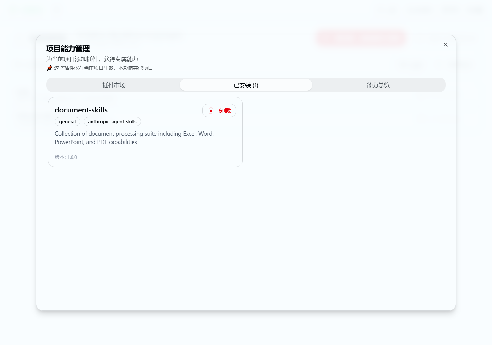
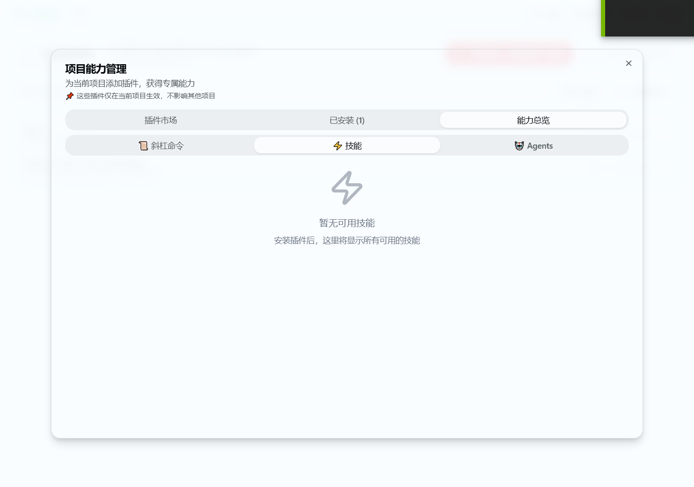
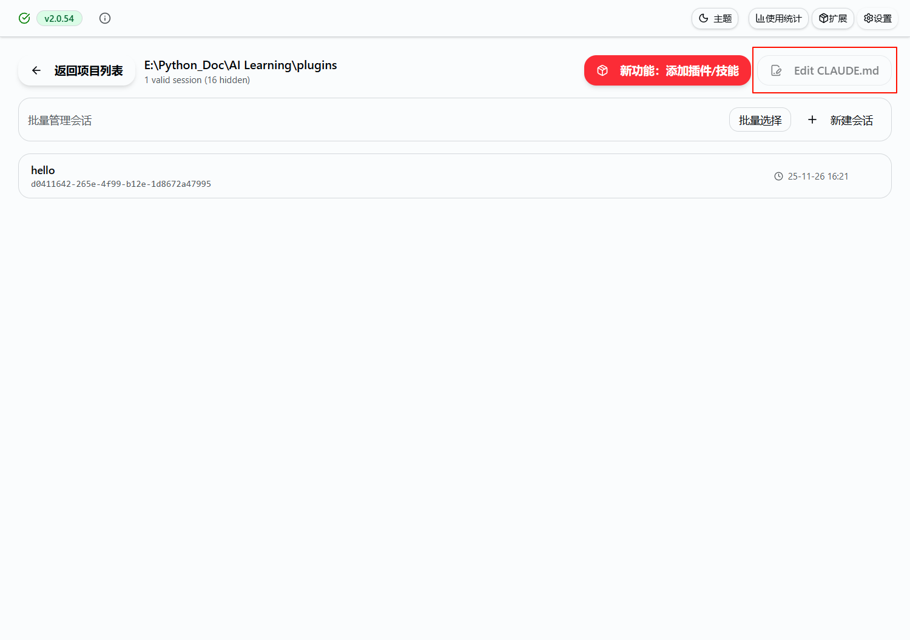
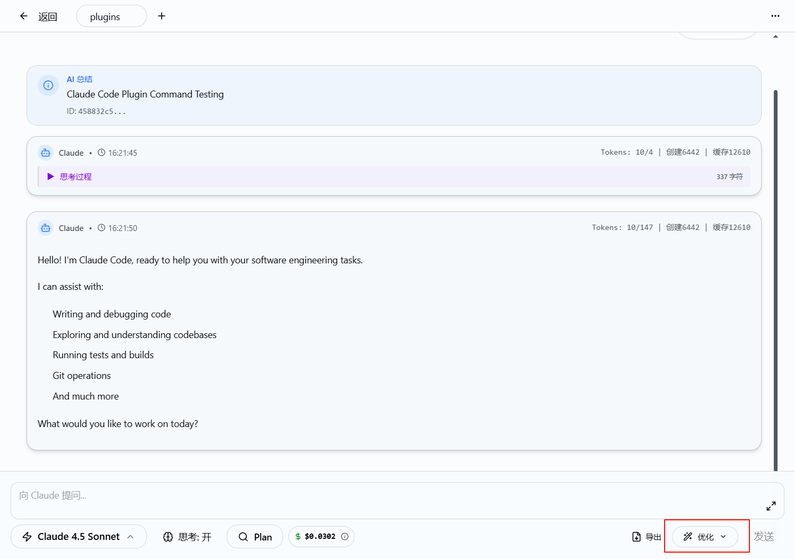
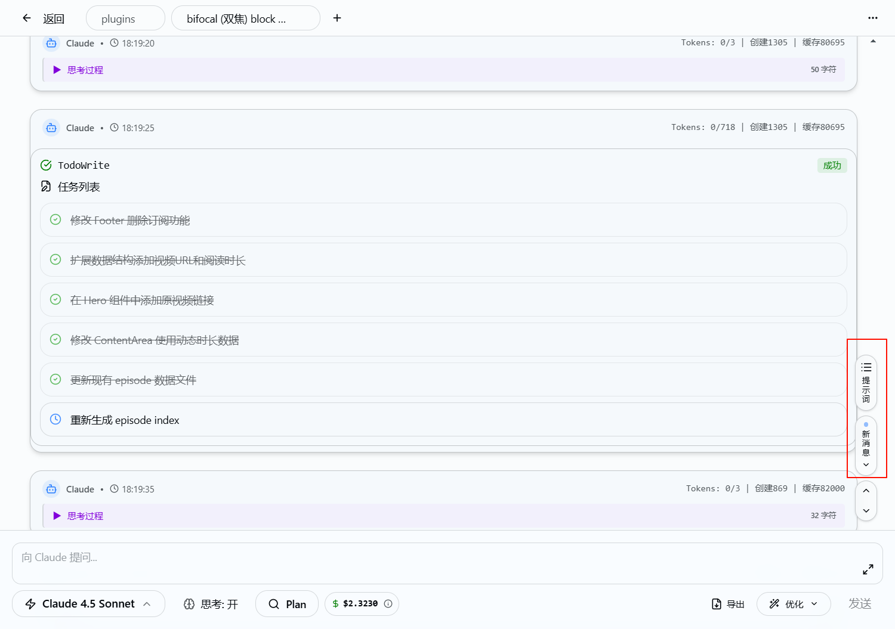

1. 项目管理界面有bug。E:\Python_Doc\AI Learning\plugins 这个目录下 E:\Python_Doc\AI Learning\plugins\.claude 已经安装了插件具有skill,但是在页面里没有显示

2. 不需要Edit CLAUDE.md

3. 对话页面不需要优化按钮

4. 对话页面不要提示词与新消息功能

5. 系统扩展管理器（全局）页面修改

   1. marketplaces在最左边
   2. 新增mcp 管理页面。参考被注释掉的代码。

我的用户主要是中文用户，但是往往官方以及其他人制作的plugins内容都是英文。能否使用glm模型进行沉浸式翻译？是否可行？沉浸式翻译方案参考：& 'e:\Python_Doc\AI Learning\claude-workbench\claude-workbench\immersive_translate.py'  可以让用户将zhipu_apikey在设置中进行填入，并选择是否开启全局沉浸式翻译（只要是有英文的地方就进行翻译） 
